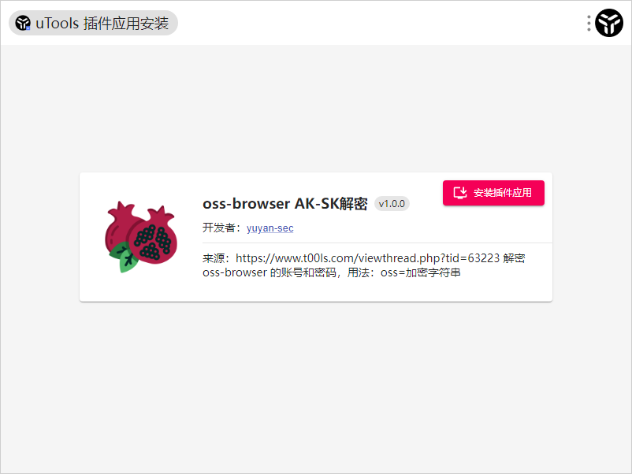
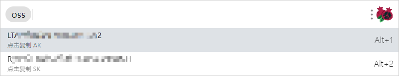

# OssDecrypt

方法来源：https://www.t00ls.com/viewthread.php?tid=63223

插件参考了该项目：https://github.com/Asuka109/utools-mineip

------

在已登录 oss browser 的情况下，获取 auth-info 加密值，进行解密得到 ak 和 sk  。

把解密功能写成了 utools 的插件，可以直接使用 *.upx 进行安装。

使用：

```
oss=Auth-Info加密值
```

目前已经把插件提交审核了，不知道能不能通过，不能通过就直接使用  *.upx 来安装。



成功解密，点击复制


